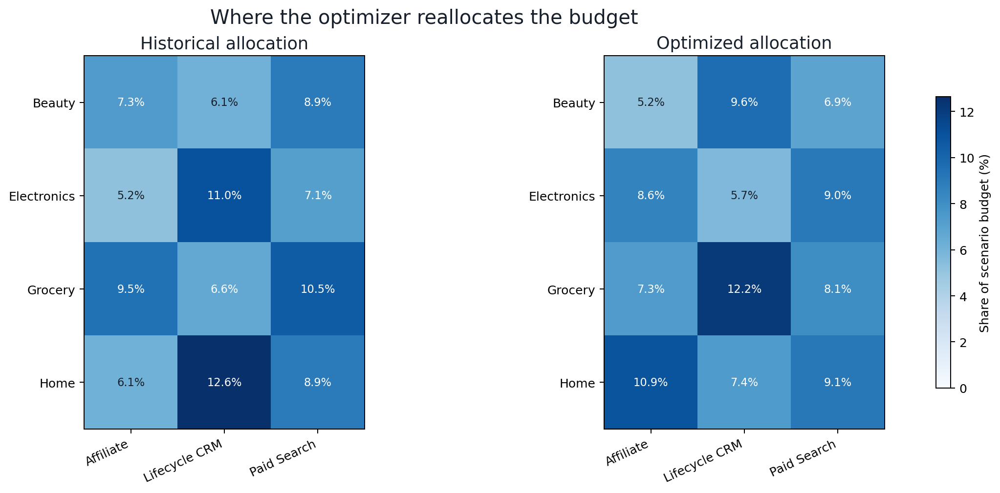
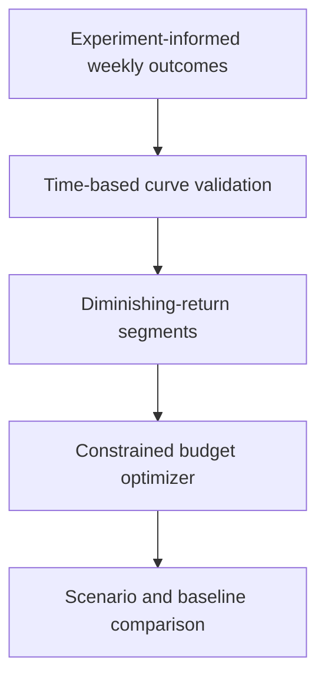
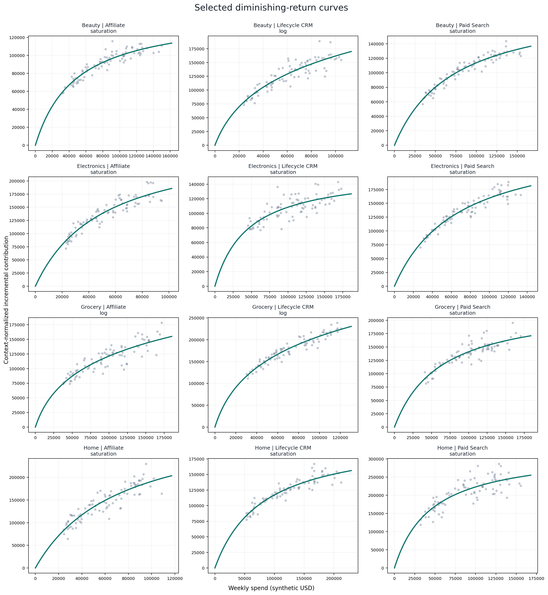
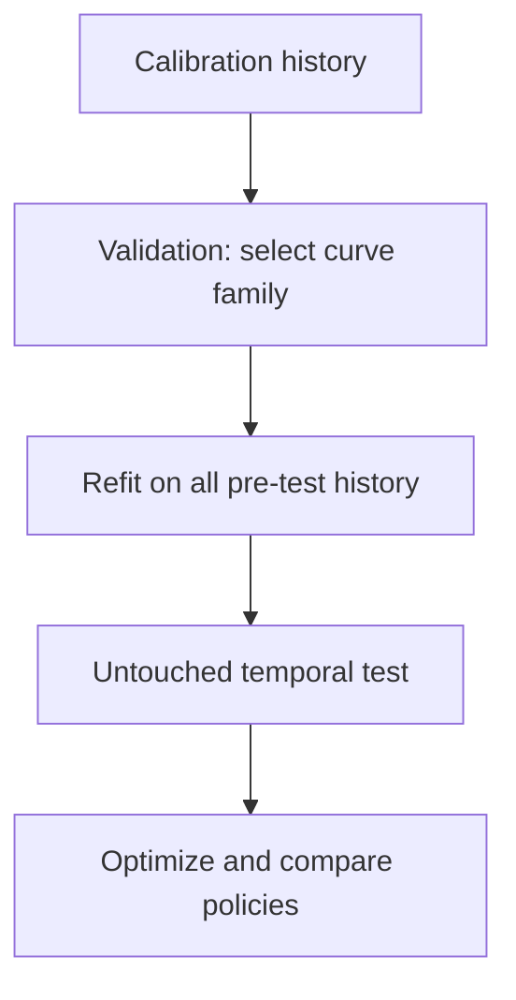
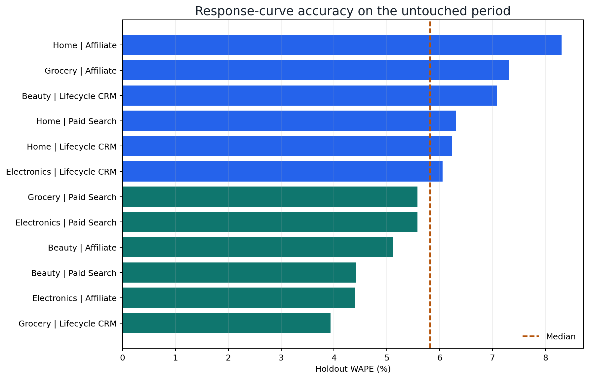
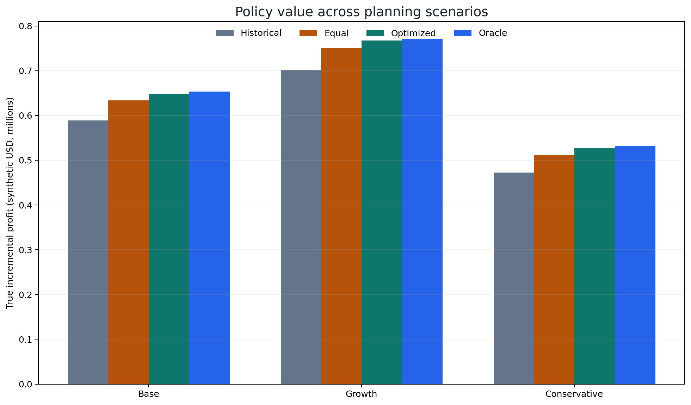

# Marketing Budget Allocation Optimizer

[](https://github.com/parisaMSTFV/marketing-budget-allocation-optimizer/actions/workflows/ci.yml)
[](https://www.python.org/)
[](DATA_PROVENANCE.md)
[](docs/weekly_response_contract.md)

Allocate a limited marketing budget across category-channel cells without ignoring
diminishing returns, operating bounds, or portfolio constraints. The pipeline accepts
experiment-informed weekly response evidence, validates curves on a later period, and
solves Base, Growth, and Conservative plans.

> The committed results and input fixture are synthetic. No employer data,
> schema, code, or internal threshold is used. A validated aggregate input path
> is available for experiment-informed weekly evidence; supplied data is never
> treated as simulation truth.

## Decision snapshot

| Committed benchmark | Result |
|---|---:|
| Profit vs feasible historical mix | **+10.2%** |
| Regret vs simulation oracle | **0.3%** |
| Material constraint violations | **0** |



## Run with weekly response evidence

```bash
python -m pip install -e ".[dev]"
marketing-allocation \
  --input-weekly-response path/to/weekly_response.csv \
  --budget 1200000 \
  --project-root path/to/output
```

Supplied-input reports use modeled metrics and omit simulation-only Oracle and regret claims. The loader requires traceable experiment or causal-estimate provenance and stops without a fallback recommendation when no allocation satisfies every constraint. See the [input contract](docs/weekly_response_contract.md).

## Business question

Given a fixed marketing budget, where should the next unit of spend go when:

- returns diminish as each category-channel cell approaches saturation;
- categories and channels require minimum presence but cannot dominate the mix;
- operating teams can only move spend inside realistic cell-level ranges;
- decision-makers want to compare expected value, risk, and disruption?

## Decision flow



## Validated results

The committed run uses seed `42`, 104 weeks, 12 category-channel cells, and an
untouched 20-week test period. The exact results are generated by the code and
recorded in [the run summary](reports/run_summary.md).

<!-- RESULTS_START -->
The selected curves achieved **5.9% mean WAPE** on the untouched period. Under
the Base scenario, the optimized mix produced **$648,387** in synthetic
incremental profit, **10.2% more** than the feasible historical mix, and ended
within **0.3%** of the simulation oracle.

| Base policy | Incremental profit | Contribution ROI | Regret vs oracle |
|---|---:|---:|---:|
| Historical | $588,638 | 1.49x | 3.5% |
| Equal | $633,626 | 1.53x | 1.1% |
| **Optimized** | **$648,387** | **1.54x** | **0.3%** |
| Oracle | $653,624 | 1.54x | 0.0% |

These values evaluate policies against hidden synthetic truth. The oracle is
available only in simulation and is never used to fit the public recommendation.
<!-- RESULTS_END -->



## Why this is an optimization project, not a scorecard

A weighted score can rank categories, but it cannot say how much to allocate and
does not represent saturation. This project estimates marginal returns and uses
a piecewise-linear program. Budget flows to the highest remaining feasible
return while preserving the agreed constraints.

## Evaluation design



- Candidate curves: linear, log, and saturation.
- Selection metric: validation WAPE per category-channel cell.
- Holdout metrics: WAPE, RMSE, and signed bias.
- Policy metrics: incremental profit, contribution ROI, allocation turnover,
  constraint violations, and regret versus a simulation-only oracle.
- A leakage test changes future outcomes and confirms that fitted parameters do
  not change.



## Allocation constraints

The default plan uses:

- exact use of the scenario budget;
- category shares between 15% and 35%;
- channel shares between 12% and 48%;
- spend for each cell between 0.4x and 2.2x its recent operating level.

These are fictional case-study assumptions. They are exposed in code and should
be replaced with approved business rules in a real planning process.

## Scenario planning

- **Base:** neutral category context and the original budget.
- **Growth:** 15% larger budget plus explicit demand multipliers.
- **Conservative:** 15% smaller budget, lower demand multipliers, and a penalty
  for cells with higher validation uncertainty.



## Repository structure

```text
src/marketing_allocation/  input validation, simulation, curves, optimization, reporting
tests/                     leakage, constraints, reproducibility, and pipeline tests
docs/                      input contract, analysis plan, metrics, model card, interview guide
reports/                   reproducible tables, figures, run summary, decision note
scripts/                   public-file sensitive-content check
.github/workflows/         CI on Python 3.11 and 3.12
```

Generated full weekly data and hidden simulator truth are excluded from Git. A
small synthetic schema sample is committed in `data/sample/`.

## Reproduce the project

Python 3.11 or later is required.

```bash
python -m venv .venv
source .venv/bin/activate
python -m pip install -e ".[dev]"
make run
make check
```

### Run with experiment-informed weekly data

Prepare a balanced aggregate CSV that follows the
[weekly response contract](docs/weekly_response_contract.md), then supply an
explicit planning budget:

```bash
marketing-allocation \
  --input-weekly-response path/to/weekly_response.csv \
  --budget 1200000 \
  --project-root path/to/output
```

The loader requires traceable `evidence_type` and `evidence_reference` fields,
rejects platform attribution as incremental evidence, and checks dates, numeric
values, cell mappings, panel completeness, and temporal history. The committed
fixture can exercise the same path without using real data:

```bash
marketing-allocation \
  --input-weekly-response data/sample/weekly_response_fixture.csv \
  --budget 1200000 \
  --test-weeks 6 \
  --validation-weeks 5 \
  --project-root /tmp/marketing-allocation-input-smoke
```

Input-mode reports use `modeled_*` metrics and never create an Oracle policy or
regret claim. If no allocation satisfies all constraints, the command stops and
writes no recommendation fallback.

On Windows PowerShell:

```powershell
.venv\Scripts\Activate.ps1
```

## Documentation

- [Analysis plan](docs/analysis_plan.md)
- [Metric dictionary](docs/metric_dictionary.md)
- [Model card](docs/model_card.md)
- [Interview guide](docs/interview_guide.md)
- [Data provenance](DATA_PROVENANCE.md)
- [Weekly response input contract](docs/weekly_response_contract.md)
- [Reproducible run summary](reports/run_summary.md)
- [Decision note](reports/decision_note.md)
- [Recommended allocation](reports/recommended_allocation.csv)

## Limitations

- The response outcome is synthetic and assumes experiment-quality incremental evidence.
- Supplied-input policy values are fitted-model estimates, not realized impact.
- One curve is fitted independently per cell; production use may need hierarchical pooling.
- Scenario multipliers are planning assumptions, not forecasts.
- The optimizer does not model creative fatigue, inventory, audience overlap, or execution delays.
- The oracle is available only because the simulator's hidden truth is known.
- Production use requires controlled experiments, approved constraints, override governance,
  and realized-value monitoring.

## License

MIT
